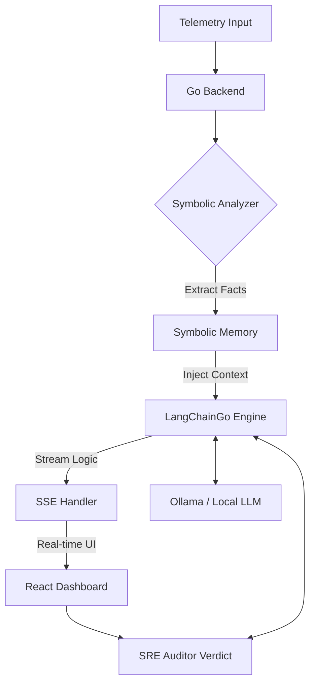

# TraceMind 🧠 — AI-Powered System Behavior Explainer

**TraceMind** is a research-oriented observability agent that uses a hybrid **Symbolic + Neural reasoning** approach to analyze system telemetry. It transforms raw, high-cardinality trace data into causal narratives, helping engineers understand *why* a system failed, not just *that* it failed.

---

## 🚀 Key Features

- **OTel-Aligned Core**: Built on OpenTelemetry-inspired data models for seamless integration with modern observability stacks.
- **Hybrid Reasoning Engine**:
  - **Symbolic Layer**: Go-based analyzer that pre-computes latency bottlenecks and error propagation facts.
  - **Neural Layer**: LLM reasoning (Mistral/Llama3) via **LangChainGo** to explain complex systemic failures.
- **Symbolic Memory**: A global health store that tracks cross-trace trends (error rates, service latency spikes) to provide historical context to the AI.
- **Real-Time Streaming (SSE)**: High-performance streaming of AI logic using Server-Sent Events, ensuring a responsive UX even with heavy local inference.
- **Research Comparison Mode**: A split-screen UI to evaluate the efficacy of **Structured Prompting** (with rules/memory) vs. **Raw Reasoning** (baseline).
- **SRE Auditor**: An automated **LLM-as-a-Judge** evaluator that scores AI explanations on technical correctness and causal logic.

---

## 🏗️ System Architecture



---

## 🛠️ Tech Stack

| Layer | Technology |
| :--- | :--- |
| **Backend API** | Go 1.25+ |
| **LLM Orchestration** | LangChainGo |
| **Local Inference** | Ollama |
| **Frontend** | React + Vite + TypeScript |
| **Styling** | Vanilla CSS (Observability Theme) |
| **Communication** | REST (Input) + SSE (Streaming AI) |

---

## 🔬 Research Components

### 📌 1. Context Engineering
TraceMind explores the reduction of LLM hallucinations in technical domains by providing "symbolic scaffolds" (pre-computed facts) instead of raw telemetry dumps. 

### 📌 2. Symbolic + Neural Hybrid
By leveraging a symbolic memory store, the agent can distinguish between isolated failures and systemic trends (e.g., "This timeout is likely related to the 33% error rate observed in the last 10 minutes").

### 📌 3. Technical Evaluation
The project includes an **SRE Auditor** to systematically grade the Technical Correctness and Rationale of generated explanations, providing a framework for continuous prompt optimization.

---

## 🚦 Getting Started

### Prerequisites
1.  **Go** (1.25 or later)
2.  **Node.js** & **npm**
3.  **Ollama** (with `mistral` or `llama3` pulled)

### Setup & Running

**1. Start Ollama**
```bash
ollama serve
# In another terminal
ollama pull mistral
```

**2. Run the Backend**
```bash
# From the root directory
export OLLAMA_MODEL=mistral
go run main.go
```

**3. Run the Frontend**
```bash
cd frontend
npm install
npm run dev -- --port 5173
```

Navigate to `http://localhost:5173` to start explaining traces!

---

Built for **LFX Mentorship Research** | AI for Observability 🚀
